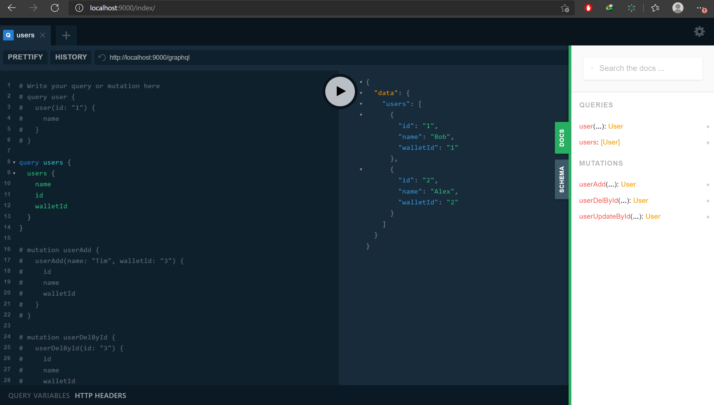

# graphql-server
This is a POC project to setup graphQL with Golang.

## Packages used
github.com/gin-gonic/gin
github.com/graphql-go/graphql
https://www.npmjs.com/package/graphql-playground-react

## Runing the project
- Run command `go run server.go` from the root project directory.
- Open `http://localhost:9000` in browser.
- Run graphQL queries in the `GraphQL playground`.

## License
MIT